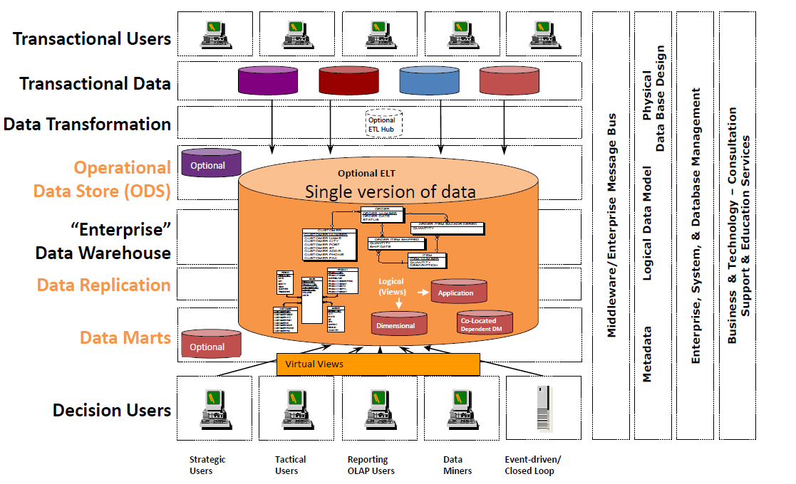
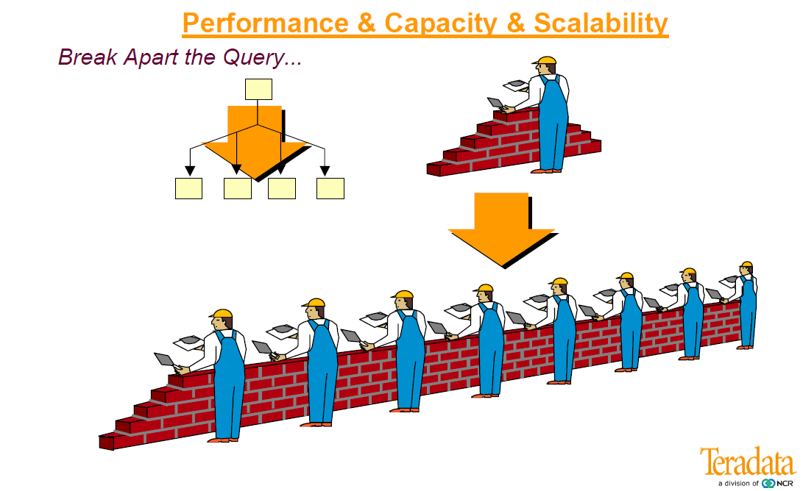
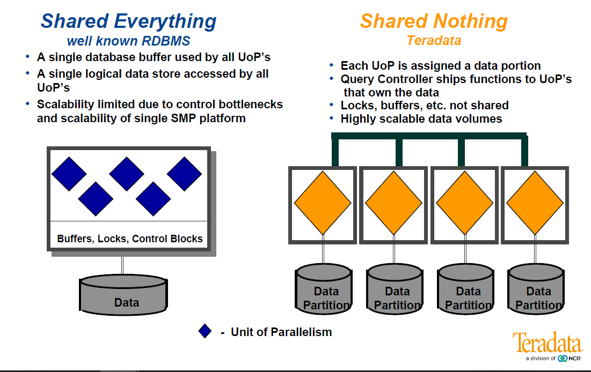
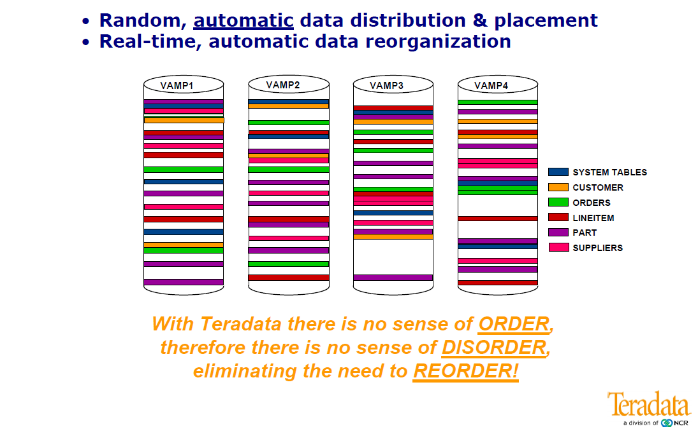
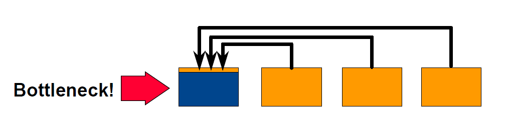
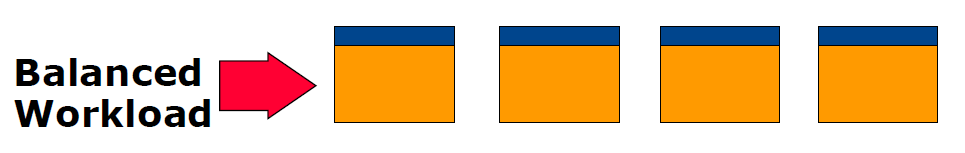
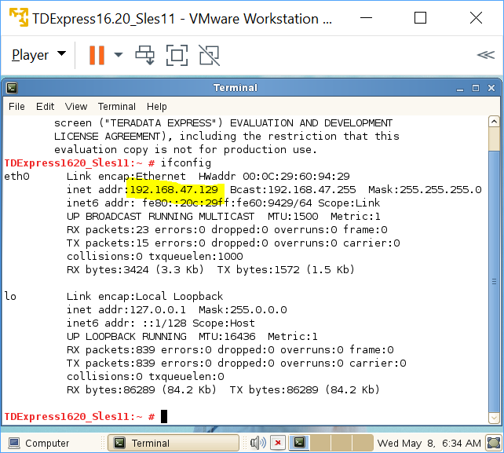

# Intro to Teradata
---

## Data Warehousing

---

## RDBMS

---
## What is Teradata?
- A global leader in enterprise data warehousing and analytic technologies.
- In data warehousing arena since 1979 in over 60 countries delivering data warehouse appliance solutions. 
- Has about 1,000 customers, with annual revenue of about $1.6 billion from data warehousing solutions. 
- Provides functionality for large, complex, mixed workload environments. 
- Newer products (Teradata Vantage) that support relational and non-relational data.

---
## What is Teradata (cont.)?

- It has specific strengths (e.g., strong penetration, data models and professional services) in the vertical markets such as retail, financial and banking, telecom and manufacturing. 
- Its largest and most prominent customer is Wal-Mart. Other customers include companies like O2, FedEx and eBay. 
- Main competitors are other mature DBMS solutions such as IBM's Netezza, Microsoft SQL Server and Oracle.
- Latest data warehouse release is Teradata 16. 

---
## What are Teradata features?
- An RDBMS designed for enterprise data warehousing.
- A massively parallel processing system to ensure that tasks are processed quickly.
- A **shared nothing** architecture.
- **Linear scalability** in all dimensions of a database system workload (i.e., data volume, breadth, number of users, complexity of queries). Can scale up to 2048 nodes.

---
## What are Teradata features (cont.)?
- **Connectivity:** to channel-attached systems such as Mainframe or Network-attached systems.  
 - **Mature Optimizer:** Quite good from the start, it has been refined for each release.     
 - **SQL:** Industry standard SQL. In addition to this, it provides its own extension. 
 - **Robust Utilities:** for import/export data from/to such as `FastLoad`, `MultiLoad`, `FastExport` and `TPT`. 
 - **Automatic Distribution:** No manual intervention for data redistribution. 

---
## Parallelism, the secret sauce

---
## Parallel Architectures

---
## Teradata Architecture

- Based on Massively Parallel Processing (MPP) architecture. 
- **Massively parallel processing (MPP)**: Multiple SMP nodes working together comprise a larger, MPP implementation. The nodes are connected using a message passing layer called BYNET, which allows multiple virtual processors on multiple nodes to communicate with each other.
- The major components of Teradata are **Parsing Engine**, **BYNET** and Access Module Processors (**AMPs**). 

---
## Components of Teradata

The key components of Teradata are: 
- **Node:** It is the basic unit in Teradata System. Each individual server in a Teradata system is referred as a Node. 
- A node consists of its own operating system, CPU, memory, own copy of Teradata RDBMS software and disk space.
- A **cabinet** consists of one or more Nodes.   

---
## Components of Teradata (cont.)
- **Parsing Engine:** Parsing Engine is responsible for receiving queries from the client and preparing an efficient execution plan. 
- The responsibilities of parsing engine are:
	- Receive the SQL query from the client. 
 	- Parse the SQL query check for syntax errors.
 	- Check if the user has required privilege against the objects used in the SQL query. 
 	- Check if the objects used in the SQL actually exists. 
 	- Prepare the execution plan to execute the SQL query and pass it to BYNET. 
 	- Receives the results from the AMPs and send to the client. 

---
## Components of Teradata (cont.)
- **Message Passing Layer:** Message Passing Layer called **BYNET**, is the networking layer in Teradata system. It allows the communication between PE and AMP and also between the nodes.
- It receives the execution plan from Parsing Engine and sends to AMP.
- Similarly, it receives the results from the AMPs and sends to Parsing Engine. 

---
## Components of Teradata (cont.)

- **Access Module Processor (AMP):** AMPs, called as Virtual Processors (vprocs) are the one that actually stores and retrieves the data.  
- AMPs receive the data and execution plan from Parsing Engine, performs any data type conversion, aggregation, filter, sorting and stores the data in the disks associated with them.
- Records from the tables are evenly distributed among the AMPs in the system.
- Each AMP is associated with a set of disks on which data is stored. Only that AMP can read/write data from the disks.  

---
## Storage Architecture
- When the client runs queries to insert records, Parsing Engine sends the records to BYNET. 
- BYNET retrieves the records and sends the row to the target AMP. 
- The AMP stores these records on its disks

---
## Retrieval Architecture
- When the client runs queries to retrieve records, Parsing Engine sends a request to BYNET.
- BYNET sends the retrieval request to appropriate AMPs.
- Then AMPs search their disks in parallel and identify the required records and sends to BYNET. 
- BYNET then sends the records to Parsing Engine which in turn will send to the client.

---
## How does Teradata store rows?

---
## Quick reminder

- **Primary Key:** Primary key is used to uniquely identify a row in a table.
	- No duplicate values are allowed in a primary key column and they cannot accept NULL values. 
	- It is a mandatory field in a table. 
- **Foreign Key:** Foreign keys are used to build a relationship between the tables. 
	- A foreign key in a child table is defined as the primary key in the parent table.
	- A table can have more than one foreign key.
	- It can accept duplicate values and also null values.
	- Foreign keys are optional in a table. 

---
## Primary Indexes

- The mechanism used to assign a row to an AMP.
- A table ~~must~~ have a **Primary Index** that cannot be changed.
	- From Teradata 13.00 tables may *not* have a primary index. Rows are randomly distributed to AMPs.
	- No PI tables are typically used as staging tables for initial load by FastLoad or TPump Array Inserts (because load is faster). 
- Primary Index can be unique (**UPI**) or non-unique (**NUPI**)

---
## Quick quiz:

- Consider a transaction table with columns `OrderNumber`, `CustomerId`, `OrderDate` and `Total`.
- How would you assign primary keys and primary indices to make your life happier?
- **Happiness** is defined as fast running queries.

---
## Solution
- **It depends**.
- Rows can be distributed using a `UPI` (in this case, `OrderNumber`, which is also the PK) or a `NUPI` (in this case, `CustomerId` or `OrderDate`). 
- In the first case, the distribution of the rows is non-skewed across AMPs, while in the second case we will have a less even row distribution.
- But the catch is on **what level of granularity do you need for analysis**.

---
## Why this matters?: `JOIN`

- In order to process records in a `JOIN`, they have to be on the same processing unit
- Most RDBMS have to send the records to a single processing unit, to perform the `JOIN`

---
## Avoiding bottlenecks

- The `JOIN` is performed balanced on all nodes if the primary index is chosen properly. 
- Each node performs a smaller part of the `JOIN`.
- Similar bottlenecks (and solutions) apply for `GROUP BY` and `ORDER` queries.

---
## Hashing algorithm
- A row is assigned to a particular AMP based on the primary index value. Teradata uses a hashing algorithm to determine which AMP gets the row.
- How this looks like:
	- The client submits a query.
	- The parser receives the query and passes the PI value of the record to the hashing algorithm.
	- The hashing algorithm hashes the primary index value and returns a 32 bit number, called **Row Hash**.

---
## Hashing algorithm (cont.)
- The higher order bits of the row hash (first 16 bits) are used to identify the hash map entry. 
- The hash map is an array of buckets which contains specific AMP number.
- BYNET sends the data to the identified AMP.
- AMP uses the 32 bit Row hash to locate the row within its disk.
- If there is any record with same row hash, then it increments the **uniqueness ID**.
- The pair of Row hash and uniqueness ID is called **Row ID**.
- Tables are sorted by their Row ID.

---
# Setting up the environment

---
## Pre-requisites

To get started, you need to download:

-	Teradata Express 16.20 VM Image.
-	VMWare Workstation 15 Player.
-	Teradata tools and utilities.
- JDK 8 and other dependencies (see the download page for TD Express).
- You can download these from: [Teradata Downloads page.](http://downloads.teradata.com/download/database/teradata-express-for-vmware-player)
- An account is required, you can create one for free.

---
## Launch your VM
	
- In VMWare Player's main window, right click on the VM name and select "Virtual Machine Settings".
- In the settings window, click on "Network Adapter" and among the options on the right, select "Host-only: a private network shared with the host".
- Click ok and boot your virtual machine.
- Login credentials are root/root

---
## Connect to your DB

- Open a terminal and type `ifconfig`. You should see an `inet addr` value as below.

--- 
## Test connection

- On your `PowerShell` or `UNIX` console, ping the IP address of your DB with the command `ping 192.168.47.129`

---
## Connect with SQLA
- Now open SQL Assistant, and create a new connection using the IP address of your DB. 
- Default credentials are dbc/dbc.
- Run a simple query.

---
## SQLA Shortcuts

- **F2**: It will open query builder, with syntax for all SQL queries.
- **F5**: Execute SQL query.
- **F6**: Explain plan for SQL query.
- **F9**: Execute SQL queries in parallel.
- **F10**: Abort SQL query.
- **F11**: Display last error encountered.
- **Ctrl + N**: New SQL query window.
- **Ctrl + Q**: Format SQL query.
- **Ctrl + U**: Convert to UPPERCASE.
- **Ctrl + H**: Find and replace.

---
## More inside SQLA

- Go to **Tools | Options | Query** to change the behavior if needed.
- **Query Builder.**
- **Beyond SQLA:** Teradata Studio / Teradata Studio Express.

