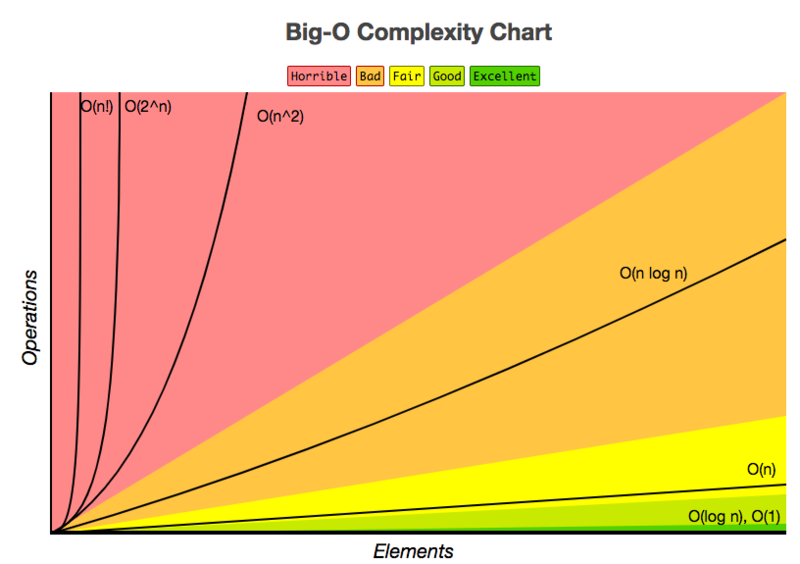

# Querying efficiently
---

---
## Estimating Time Complexity of Your Query Plan

- The execution plan defines, among other things, what algorithm is used for each operation, which makes that every query execution time can be logically expressed as a function of the table size involved in the query plan, which is referred to as a complexity function. 
- There are four main types of time complexity:
	- Constant.
	- Linear.
	- Logarithmic.
	- Quadratic.


---
## O(1): Constant Time
- An algorithm is said to run in constant time if it requires the same amount of time regardless of the input size. When you’re talking about a query, it will run in constant time if it requires the same amount of time irrespective of the table size.

- These type of queries are not really common, yet here’s one such an example:

```
SELECT TOP 1 t.* 
FROM t
```

- The time complexity is constant because you select one arbitrary row from the table. Therefore, the length of the time should be independent of the size of the table.

---
## Linear Time: O(n)

- An algorithm is said to run in linear time if its time execution is directly proportional to the input size, i.e. time grows linearly as input size increases.
- For databases, this means that the time execution would be directly proportional to the table size: as the number of rows in the table grows, the time for the query grows.

- **Example:** a query with a WHERE clause on a un-indexed column:
	- A **full table scan** is needed.
	- This means that every row needs to be read to find the one with the right ID.
	- You don’t have a limit at all, so every row does need to be read, even if the first row matches the condition.


---
## Linear Time: O(n) (cont.)
Consider also the following example of a query that would have a complexity of O(n) if there’s no index on `i_id`:

```
SELECT i_id 
FROM item;
```
- Other queries, such as count queries like `COUNT(*) FROM TABLE`; will have a time complexity of O(n), because a full table scan will be required unless the total row count is stored for the table.
- If that is the case, the complexity would be more like O(1).

---
## Linear Time: JOIN

- A hash join has an expected complexity O(M + N). The classic hash join algorithm for an inner join of two tables first prepares a hash table of the smaller table. The hash table entries consist of the join attribute and its row. The hash table is accessed by applying a hash function to the join attribute. Once the hash table is built, the larger table is scanned and the relevant rows from the smaller table are found by looking in the hash table.

---
## Linear Time: JOIN (cont.)
- Merge joins generally have a complexity of O(M+N) but it will heavily depend on the indexes on the join columns and, in cases where there is no index, on whether the rows are sorted according to the keys used in the join:
	- If both tables that are sorted according to the keys that are being used in the join, or if both tables have an index on the joined columns, then the complexity will be O(M + N).
	- If neither table has an index on the joined columns, a sort of both tables will need to happen first so that the complexity will look more like O(M log M + N log N).
	- For nested joins, the complexity is generally O(MN). This join is efficient when one or both of the tables are extremely small (for example, smaller than 10 records).


---
## Logarithmic Time: O(log (n))

- An algorithm is said to run in logarithmic time if its time execution is proportional to the logarithm of the input size.
- For queries, this means that they will run if the execution time is proportional to the logarithm of the database size.

- **Example:** Suppose there is an index on `i_i`d. The following query has a complexity of O(log(n)):

```
SELECT i_stock 
FROM item 
WHERE i_id = N; 
```

- Note that without the index, the time complexity would have been O(n).


---
## Quadratic Time: O($n^2$)

- An algorithm is said to run in quadratic time if its time execution is proportional to the square of the input size.
- Once again, for databases, this means that the execution time for a query is proportional to the square of the database size.

- **Example**:

```
SELECT * 
FROM item, author 
WHERE item.i_a_id=author.a_id 
```

- This query has O($n^2$) complexity as a worst-case scenario, depending on the index structure.


---
##


- First things to look after: 
	- `JOIN ... ON` and index structure of the involved tables.
	- `WHERE` clauses.

---
## General rules
- **Know your data:** Understand the relationships between tables, know your data, and *fetch only the required columns.*
- **`JOINs:`** Be reasonable with CROSS JOIN or LEFT joins. Bad joins with skew values result in high CPU and IO queries.
- **Data types:** Ensure appropriate data types for columns on the table(s). For example, don't define a `VARCHAR` data type for a `Salary` column. 
- **Pre-aggregate data:** To avoid carrying a large number of rows, do aggregations and then join. Extra points if you do those in a volatile table.
- **Prioritize optimization:** A moderately slow query repeated often is a better candidate for tuning than a query running once a year that takes several hours.


---
# Collecting Statistics
---

---
## Why do we need statistics
- The execution strategy is based on the statistics collected on the tables used within the SQL query. Statistics on the table is collected using the `COLLECT STATISTICS` command. 
- Optimizer requires environment information and data demographics to come up with the optimal execution strategy.


---
## Information collected
- **Environment Information**
  - Number of Nodes, AMPs and CPUs.
  - Amount of memory.
- **Data Demographics.**
  - Number of rows.
  - Row size.
  - Range of values in the table.
  - Number of rows per value.
  - Number of Nulls.

---
## Approaches
There are three approaches to collect statistics on the table.
- Random AMP Sampling.
- Full statistics collection.
- Using SAMPLE option.

---
## Collecting and viewing statistics
- `COLLECT STATISTICS COLUMN(EmpNo) ON Employee;`
- `HELP STATISTICS Employee;`
- More examples:
https://dbmstutorials.com/teradata/teradata-collect-stats.html

---
# `EXPLAIN`
- Explain plan is the step-by-step English translation of a query plan generated by the parsing engine. Explain plan can give you a clear picture the way optimizer will execute a query.
- 
- It is a good practice to analyze the explain plan for a newly developed query before running it in the Teradata system. Explain plan can be obtained by 2 ways. 

- Provides a lot of information like-

	- Access path – If data is fetching using full table scan or using any index like primary index path, secondary index path or any other kind.
	- Confidence level – If the optimizer is able to use the statistics or any statistics is missing.
	- Joins information – What kind of join is going to happen.
	- **Time estimation – Provides estimated of query completion time.

---
## Explaining `EXPLAIN`
- **Locking Information:** Explain plan provides information about locking. This lock can be like Pseudo table which is placed to avoid global deadlock conditions, read, write, access and exclusive lock.

- **Row retrieval Strategy:** Teradata may fetch rows by full table scan, using primary index, using secondary index or any other access path.

- **Time & Size estimation information:** Explain plan also provides the information about estimated row counts and estimated time to complete a particular step and query.

---
## Explaining `EXPLAIN` (cont.)

- As all the AMP work independently, they can’t access other AMP data directly. So for join processing rows should be in the same AMP. Teradata decides to redistribute, duplicate to bring the rows to be joined on the same AMP.
- **Join information:** In case of join operation, explain plan will show you what kind of join operation is chosen by the optimizer base on the situation. You will see something like product join, single partition hash join, merge join etc.

---
## Explaining `EXPLAIN` (cont.)

- **Confidence level:** In the explain of a query, you will find something like high confidence, low confidence, no confidence. These are obtained through the statistics collection phase.
- **AMPs involvement information:** During any kind of operation like retrieving rows, joining tables, aggregation you will get information about how many  amps take part in that operation. Depends on the work, it can be single AMP, group AMP or all AMPs.